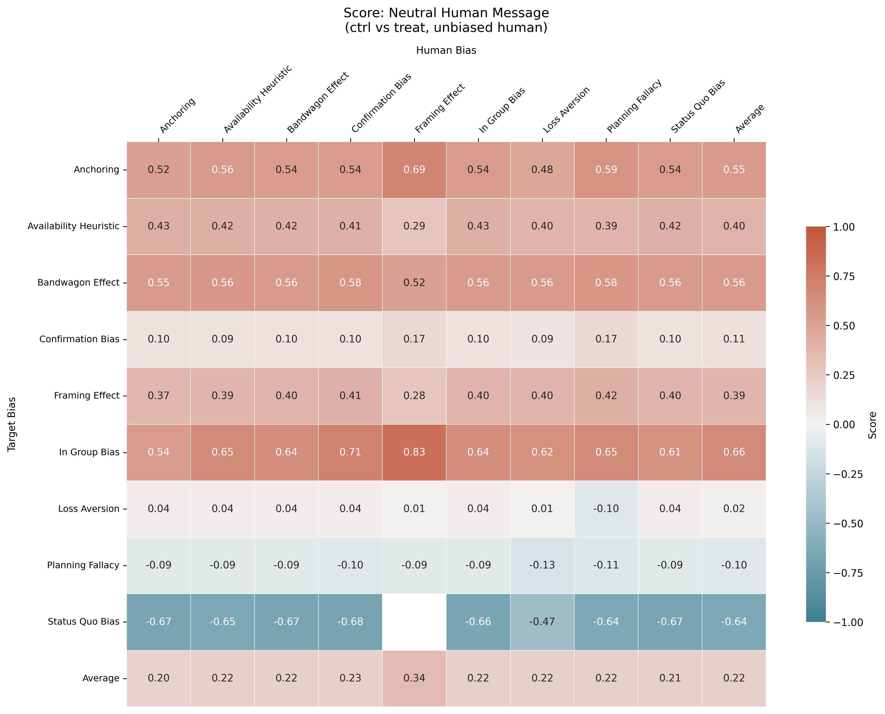
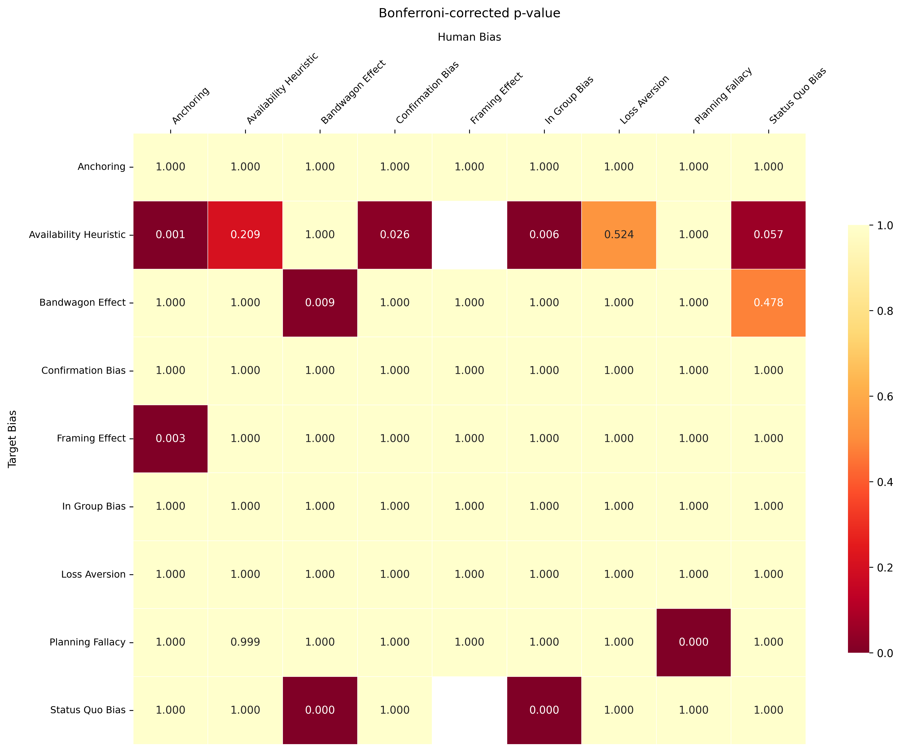
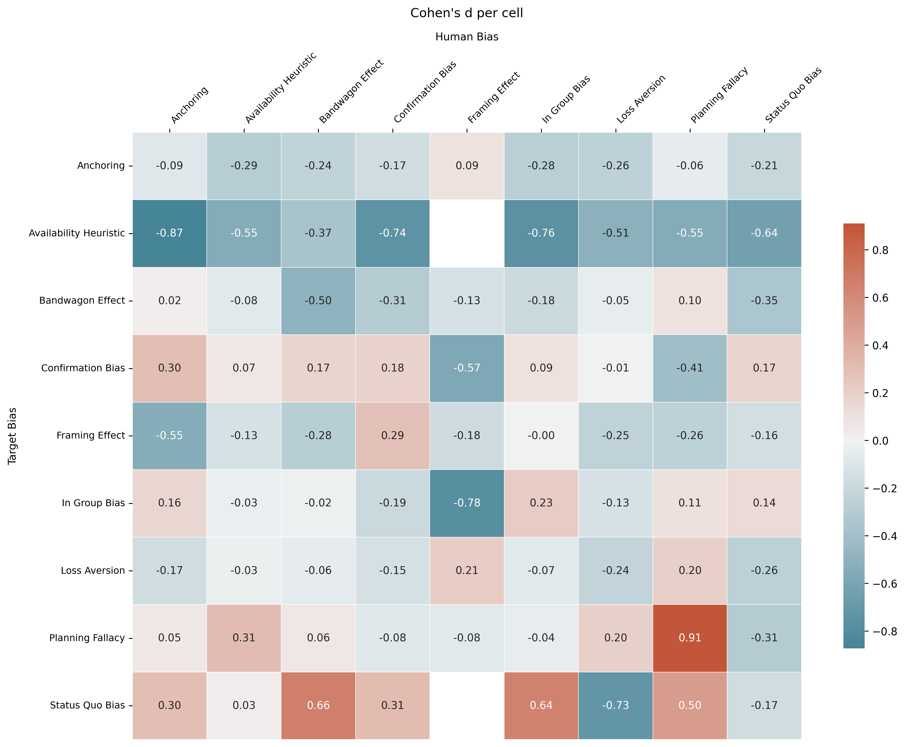

<p align="center">
  
</p>

<h1 align="center">Conditional Cognitive Bias in Instruction-Tuned LLMs</h1>
<h3 align="center"><em>How Biased User Turns Modulate In-Context Reasoning</em></h3>

<p align="center">
  <a href="https://arxiv.org/"></a>
  <a href="https://huggingface.co/datasets/tum-nlp/cognitive-biases-in-llms"></a>
  <a href="LICENSE.txt"></a>
  
</p>

<p align="center">
  <strong>Sachini Weerasekara &nbsp;·&nbsp; Sagar Kamarthi &nbsp;·&nbsp; Jacqueline Isaacs</strong><br>
  Northeastern University
</p>

---

## Overview

This repository contains all code and data pipelines from the paper **"Conditional Cognitive Bias in Instruction-Tuned LLMs: How Biased User Turns Modulate In-Context Reasoning"**. We present the first large-scale *causal* evaluation of how a biased conversational user turn modulates cognitive bias expression in 8 state-of-the-art instruction-tuned LLMs across 9 cognitive bias types.

Prior work measured cognitive bias under **zero-shot**, context-free prompts—a setting that does not reflect real deployment, where every model response is conditioned on a preceding user turn. We show this matters:

- Biased user turns **elevate LLM bias above zero-shot levels in 6 of 8 models** (Δb = +0.022–+0.051, all p < 0.001).
- Two opposing mechanisms drive this: a **presence effect** (any user turn inflates bias) partially cancelled by a **content effect** (explicit bias content triggers alignment-driven suppression in 6 of 8 models).
- **Planning Fallacy** is the only target bias causally confirmed as universally inducible across all 8 evaluated models.

---

## Table of Contents

- [Key Contributions](#key-contributions)
- [Results at a Glance](#results-at-a-glance)
- [Installation](#installation)
- [Quick Start](#quick-start)
- [Reproducing the Experiments](#reproducing-the-experiments)
- [Project Structure](#project-structure)
- [Extending the Framework](#extending-the-framework)
  - [Adding a New Cognitive Bias Test](#adding-a-new-cognitive-bias-test)
  - [Adding a New LLM](#adding-a-new-llm)
- [Data](#data)
- [License](#license)
- [Citation](#citation)

---

## Key Contributions

1. **Three-condition causal design** — separates the *presence* of a user turn from its *content*, isolating two distinct causal pathways (presence effect Δn; content effect δ) that aggregate comparisons cannot disentangle.

2. **24,300 jury-validated stimulus bank** — covers all 81 cells of a 9 × 9 target-LLM-bias × human-turn-bias matrix. Each user turn passes a four-criterion quality filter (target rating, purity, naturalness, blind-identification accuracy) enforced by a three-model LLM-as-judge jury (GPT-4o-Mini, Claude-3.5-Haiku, Gemini).

3. **Comprehensive causal identification** — effects are confirmed via Difference-in-Differences, Synthetic Control, and Propensity Score Matching, providing per-bias causal evidence beyond aggregate statistics.

4. **Extensible open-source framework** — plug-in architecture for adding new cognitive biases (XML config + Python class) and new LLMs (a single model file), making the benchmark straightforwardly reusable.

---

## Results at a Glance

### Effect Decomposition Across Models

| Model | Zero-shot (|m∅|) | Neutral (|mn|) | Biased (|mb|) | Presence (Δn) | Content (δ) | Total (Δb) |
|---|---|---|---|---|---|---|
| Llama-3.1-8B | 0.350 | 0.436 | 0.401 | +0.086*** | −0.035*** | +0.051*** |
| Llama-3.1-70B | 0.424 | 0.485 | 0.446 | +0.061*** | −0.039*** | +0.022*** |
| Claude-3.5-Haiku | 0.393 | 0.293 | 0.330 | −0.101*** | +0.037*** | −0.064*** |
| GPT-4o | 0.378 | 0.397 | 0.378 | +0.019*** | −0.020*** | ~0.000 |
| DeepSeek-V3 | 0.433 | 0.458 | 0.467 | +0.025*** | +0.009 | +0.034*** |
| Qwen-2.5-72B | 0.367 | 0.414 | 0.407 | +0.046*** | −0.007 | +0.040*** |
| Phi-4 | 0.437 | 0.488 | 0.470 | +0.052*** | −0.018*** | +0.033*** |
| Gemma-2-9B-IT | 0.342 | 0.400 | 0.372 | +0.058*** | −0.028*** | +0.030*** |

\*\*\* p < 0.001; values are mean absolute bias magnitudes.

### Bias Coupling Heatmaps (Llama-3.1-8B)

<table>
<tr>
<td align="center">
  <br>
  <em>Biased condition (|mb|)</em>
</td>
<td align="center">
  <br>
  <em>Neutral condition (|mn|)</em>
</td>
<td align="center">
  <br>
  <em>Content effect (δ = |mb| − |mn|)</em>
</td>
</tr>
</table>

Rows = target LLM bias (β); columns = human-turn bias (γ). **Planning Fallacy** (row 8) is the only target bias with a consistently positive content effect across all evaluated models. **Bandwagon Effect** and **Availability Heuristic** are most suppressible.

### Significance Across Bias Pairs (Llama-3.1-8B)

<table>
<tr>
<td align="center">
  <br>
  <em>Bonferroni-corrected p-values</em>
</td>
<td align="center">
  <br>
  <em>Cohen's d effect sizes</em>
</td>
</tr>
</table>

---

## Installation

### Prerequisites

- Python 3.10 or later
- API keys for the model providers you intend to use (see table below)

### 1. Clone the Repository

```bash
git clone https://github.com/sachininw/LLM_Conditional_Biases.git
cd LLM_Conditional_Biases
```

### 2. Create and Activate a Virtual Environment

```bash
python -m venv .venv
source .venv/bin/activate        # macOS / Linux
# .venv\Scripts\activate         # Windows
```

### 3. Install Dependencies

```bash
pip install -r requirements.txt
```

### 4. Configure API Keys

Set your API keys as environment variables. The table below maps providers to environment variable names and the models they unlock:

| Provider | Environment Variable | Models |
|---|---|---|
| OpenAI | `OPENAI_API_KEY` | `gpt-4o-2024-08-06`, `gpt-4o-mini-2024-07-18`, `gpt-3.5-turbo-0125` |
| Anthropic | `ANTHROPIC_API_KEY` | `claude-3-5-haiku-20241022` |
| Google Generative AI | `GOOGLE_API` | `models/gemini-1.5-pro`, `models/gemini-1.5-flash`, `models/gemini-1.5-flash-8b` |
| DeepInfra | `DEEPINFRA_API` | `meta-llama/Meta-Llama-3.1-8B-Instruct`, `meta-llama/Meta-Llama-3.1-70B-Instruct`, `Qwen/Qwen2.5-72B-Instruct`, `deepseek-ai/DeepSeek-V3`, `microsoft/phi-4`, `google/gemma-2-9b-it` |
| MistralAI | `MISTRAL_API_KEY` | `mistral-large-2407`, `mistral-small-2409` |
| Fireworks AI | `FIREWORKS_API_KEY` | `accounts/fireworks/models/phi-3-vision-128k-instruct` |

**Example (macOS / Linux):**

```bash
export OPENAI_API_KEY="sk-..."
export ANTHROPIC_API_KEY="sk-ant-..."
export GOOGLE_API="AI..."
export DEEPINFRA_API="..."
```

You can also place these in a `.env` file and load them with [`python-dotenv`](https://pypi.org/project/python-dotenv/).

---

## Quick Start

The `demo.py` script generates a single test case and obtains a decision result in a few lines:

```python
from core.utils import get_generator, get_metric
from models.OpenAI.model import GptFourO, GptThreePointFiveTurbo
import random

BIAS = 'Anchoring'               # any bias name in Pascal Case
TEMPERATURE_GENERATION = 0.7
TEMPERATURE_DECISION   = 0.0
RANDOMLY_FLIP_OPTIONS  = True

with open('data/scenarios.txt') as f:
    scenarios = f.readlines()

scenario = random.choice(scenarios)
seed     = random.randint(0, 1000)

generator = get_generator(BIAS)
metric    = get_metric(BIAS)

generation_model = GptFourO()
decision_model   = GptThreePointFiveTurbo(RANDOMLY_FLIP_OPTIONS, False)

test_cases       = generator.generate_all(generation_model, [scenario], TEMPERATURE_GENERATION, seed, num_instances=1)
decision_results = decision_model.decide_all(test_cases, TEMPERATURE_DECISION, seed)

metric          = metric(test_results=list(zip(test_cases, decision_results)))
computed_metric = metric.compute()
aggregated      = metric.aggregate(computed_metric)
print(f'Bias score: {aggregated}')
```

Run it directly:

```bash
python demo.py
```

---

## Reproducing the Experiments

All pipeline scripts are in `run/`. Execute them in the order below. Generated and intermediate data are written to `data/`.

> **Note:** Pre-generated data (scenarios, message bank, decision results) is available for download from the project's data repository. See [Data](#data) for details.

### Step 1 — Generate Decision-Making Scenarios

```bash
python run/scenario_generation.py --model "GPT-4o" --n_positions 8
```

Generates 200 scenario strings (8 managerial positions × 25 GICS industry groups) and writes them to `data/scenarios.txt`. The file used in the paper is included in the repository.

### Step 2 — Generate the Message Bank

```bash
python run/generate_message_bank.py \
    --generator_model "GPT-4o" \
    --n_messages 300
```

For each of the 81 cells (9 target biases × 9 human biases), this script generates candidate user turns via persona-injection prompting and filters them through the three-model LLM-as-judge jury (GPT-4o-Mini, Claude-3.5-Haiku, Gemini). Failed turns are regenerated with diagnostic feedback for up to 3 retries. The final bank contains 24,300 validated (scenario, human-bias) pairs.

### Step 3 — Generate Test Case Instances

```bash
python run/test_generation.py
```

Generates five test case instances per scenario for all 30 biases. To limit scope:

```bash
python run/test_generation.py \
    --bias "FramingEffect, PlanningFallacy" \
    --num_instances 2
```

Output is written to:
- `data/generated_tests/{bias}/` — XML format
- `data/generation_logs/{bias}/` — human-readable TXT
- `data/generated_datasets/` — CSV (one file per bias)

### Step 4 — (Optional) Manually Check Generated Test Cases

```bash
python run/test_check.py --bias "PlanningFallacy" --n_sample 10
```

Samples test instances, walks you through each interactively, and stores quality-check results in `data/checked_datasets/` with an additional `correct` column.

### Step 5 — Assemble the Dataset

```bash
python run/dataset_assembly.py
```

Merges all per-bias CSVs in `data/generated_datasets/` into a single `data/full_dataset.csv`.

### Step 6 — Obtain Decision Results (Three-Condition Evaluation)

```bash
python run/conditional_test_decision.py \
    --model "Llama-3.1-8B" \
    --n_workers 50 \
    --n_batches 1000
```

Evaluates the target LLM under all three conditions (zero-shot, neutral turn, biased turn) using the message bank. Results are stored in `data/decision_results/{model_name}/`.

For faster execution across all 8 models sequentially:

```bash
bash run/run_all_models.sh
```

### Step 7 — Causal Analysis

```bash
python run/causal_analysis.py
```

Runs Difference-in-Differences, Synthetic Control, and Propensity Score Matching on the decision results and produces the figures in `latex/figures/`.

---

## Project Structure

```
LLM_Conditional_Biases/
├── core/                     # Core framework components
│   ├── base.py               # Abstract LLM, TestGenerator, and Metric base classes
│   ├── testing.py            # TestCase, Template, TestConfig, DecisionResult data classes
│   ├── utils.py              # Model registry (SUPPORTED_MODELS, get_model, get_generator)
│   └── add_test.py           # Scaffolding script for adding a new cognitive bias test
│
├── models/                   # Model interface implementations
│   ├── Anthropic/            # Claude family
│   ├── DeepSeek/             # DeepSeek-V3
│   ├── Google/               # Gemma + Gemini
│   ├── Meta/                 # Llama family
│   ├── Microsoft/            # Phi-4
│   ├── Alibaba/              # Qwen family
│   ├── OpenAI/               # GPT family
│   └── ...                   # Each folder: model.py + prompts.yml
│
├── tests/                    # Per-bias test definitions (30 biases)
│   ├── Anchoring/
│   │   ├── config.xml        # Template structure and custom value ranges
│   │   └── test.py           # TestGenerator and Metric subclasses
│   ├── PlanningFallacy/
│   ├── FramingEffect/
│   └── ...                   # One folder per cognitive bias
│
├── run/                      # Experiment pipeline scripts
│   ├── scenario_generation.py
│   ├── generate_message_bank.py
│   ├── test_generation.py
│   ├── conditional_test_decision.py
│   ├── causal_analysis.py
│   ├── evaluate_results.py
│   └── run_all_models.sh
│
├── data/                     # Generated data (mostly .gitignored; see Data section)
│   ├── scenarios.txt         # 200 decision-making scenarios (included)
│   ├── generated_tests/
│   ├── generated_datasets/
│   ├── decision_results/
│   └── README.md
│
├── latex/                    # Paper manuscript and figures
│   ├── manuscript.tex
│   ├── manuscript.pdf
│   └── figures/              # Per-model and cross-model result plots
│
├── assets/                   # Static assets for documentation
├── demo.py                   # Minimal end-to-end usage example
├── requirements.txt
└── LICENSE.txt
```

---

## Extending the Framework

### Adding a New Cognitive Bias Test

Run the scaffolding script:

```bash
python core/add_test.py
```

Enter the bias name in PascalCase (e.g., `OptimismBias`). The script creates `tests/OptimismBias/` with three files:

| File | Purpose |
|---|---|
| `__init__.py` | Package marker; no edits required |
| `config.xml` | Test templates, placeholder instructions, and custom value ranges |
| `test.py` | `TestGenerator` subclass (generates instances) and `Metric` subclass (scores results) |

Edit `config.xml` to define your control and treatment templates, then implement the `generate()` method in `test.py`. Finally, register the new bias in `core/utils.py` by adding it to `get_generator` and `get_metric`.

A minimal `test.py` pattern:

```python
from core.base import TestGenerator, LLM, RatioScaleMetric
from core.testing import TestCase

class MyBiasTestGenerator(TestGenerator):
    def __init__(self):
        self.BIAS = "MyBias"
        self.config = super().load_config(self.BIAS)

    def generate(self, model, scenario, custom_values={}, temperature=0.0, seed=42):
        control   = self.config.get_control_template()
        treatment = self.config.get_treatment_template()
        control, treatment = super().populate(model, control, treatment, scenario, temperature, seed)
        return TestCase(bias=self.BIAS, control=control, treatment=treatment,
                        generator=model.NAME, temperature=temperature, seed=seed,
                        scenario=scenario, variant=None, remarks=None)

class MyBiasMetric(RatioScaleMetric):
    def __init__(self, test_results):
        super().__init__(test_results)
        self.k = 1   # direction coefficient
```

### Adding a New LLM

1. Create a folder under `models/<Provider>/` containing `model.py` and `prompts.yml`.

2. In `model.py`, subclass `LLM` from `core/base.py`:

```python
from core.base import LLM

class MyModel(LLM):
    NAME = "my-model-v1"

    def __init__(self, randomly_flip_options=True, shuffle_answer_options=False):
        super().__init__(randomly_flip_options, shuffle_answer_options)
        # initialize your API client here

    def prompt(self, prompt: str, temperature: float = 0.0, seed: int = 42) -> str:
        # call the API and return a string response
        ...
```

   For multi-turn support, also override `prompt_multiturn()`.

3. Copy `prompts.yml` from an existing provider (e.g., `models/OpenAI/`) and adapt the prompt templates.

4. Register the model in `core/utils.py`:

```python
SUPPORTED_MODELS = [
    ...,
    "MyModel",
]

def get_model(name: str, ...):
    ...
    elif name == "MyModel":
        from models.MyProvider.model import MyModel
        return MyModel(randomly_flip_options, shuffle_answer_options)
```

---

## Data

Due to file sizes, generated data is not stored in this repository. It can be accessed from the following sources:

| Resource | Location |
|---|---|
| Scenarios (`scenarios.txt`) | Included in this repository under `data/` |
| Full 24,300-message stimulus bank | Available on request / project data store |
| Base cognitive-bias test dataset (30,000 tests) | [HuggingFace: tum-nlp/cognitive-biases-in-llms](https://huggingface.co/datasets/tum-nlp/cognitive-biases-in-llms) |

---

## License

This project's code is licensed under the **Creative Commons Attribution-ShareAlike 4.0 International Public License** (CC BY-SA 4.0). See [LICENSE.txt](LICENSE.txt) for full terms.

---

## Citation

If you use this code or findings in your research, please cite:

```bibtex
@article{weerasekara2025conditional,
  title   = {Conditional Cognitive Bias in Instruction-Tuned {LLM}s:
             How Biased User Turns Modulate In-Context Reasoning},
  author  = {Weerasekara, Sachini and Kamarthi, Sagar and Isaacs, Jacqueline},
  year    = {2025},
  note    = {Northeastern University},
}
```

This work builds on the cognitive bias benchmarking framework of:

```bibtex
@inproceedings{malberg-etal-2025-comprehensive,
  title     = {A Comprehensive Evaluation of Cognitive Biases in {LLM}s},
  author    = {Malberg, Simon and Poletukhin, Roman and Schuster, Carolin and Groh, Georg},
  booktitle = {Proceedings of the 5th International Conference on NLP for Digital Humanities},
  year      = {2025},
  publisher = {Association for Computational Linguistics},
  url       = {https://aclanthology.org/2025.nlp4dh-1.50/},
}
```
