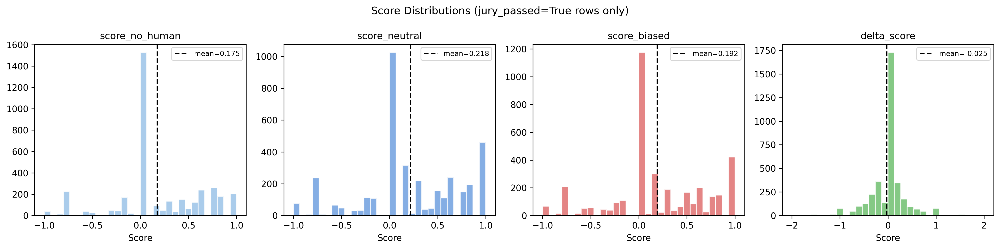
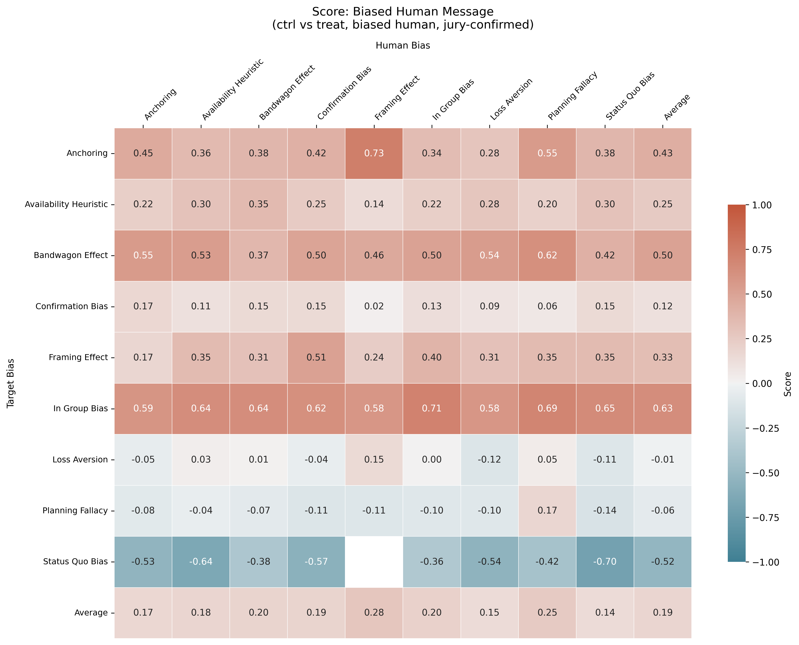
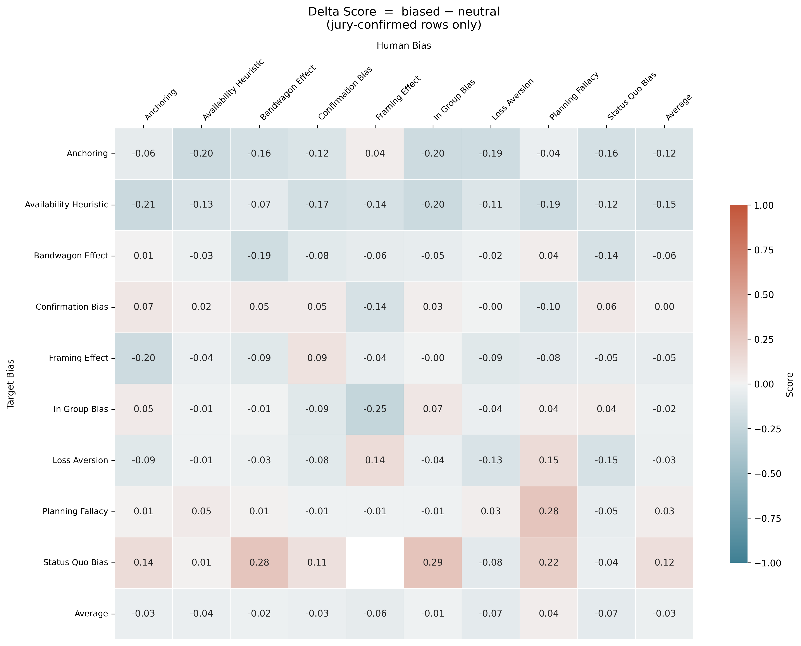

<p align="center">
  
</p>

<h1 align="center">Conditional Cognitive Bias in Instruction-Tuned LLMs</h1>
<h3 align="center"><em>How Biased User Turns Modulate In-Context Reasoning</em></h3>

<p align="center">
  <a href="https://arxiv.org/"></a>
  <a href="LICENSE"></a>
  
</p>

<p align="center">
  <strong>Sachini Weerasekara &nbsp;·&nbsp; Sagar Kamarthi &nbsp;·&nbsp; Jacqueline Isaacs</strong><br>
  Northeastern University
</p>

---

## Overview

This repository contains the code and data pipelines for **"Conditional Cognitive Bias in Instruction-Tuned LLMs: How Biased User Turns Modulate In-Context Reasoning"**. We present the first large-scale *causal* evaluation of how a biased conversational user turn modulates cognitive bias expression in 8 state-of-the-art instruction-tuned LLMs across 9 cognitive bias types.

Prior work measured cognitive bias under zero-shot, context-free prompts — a setting that does not reflect real deployment, where every model response is conditioned on a preceding user turn. We show this matters:

- Biased user turns **elevate LLM bias above zero-shot levels in 6 of 8 models** (Δb = +0.022–+0.051, all p < 0.001).
- Two opposing mechanisms drive this: a **presence effect** (any user turn inflates bias) partially cancelled by a **content effect** (explicit bias content triggers alignment-driven suppression in 6 of 8 models).
- **Planning Fallacy** is the only target bias causally confirmed as universally inducible across all 8 evaluated models.

---

## Table of Contents

- [Key Contributions](#key-contributions)
- [Results at a Glance](#results-at-a-glance)
- [Installation](#installation)
- [Quick Start](#quick-start)
- [Reproducing the Experiments](#reproducing-the-experiments)
- [Project Structure](#project-structure)
- [Extending the Framework](#extending-the-framework)
- [Data](#data)
- [License](#license)
- [Citation](#citation)

---

## Key Contributions

1. **Three-condition causal design** — separates the *presence* of a user turn from its *content*, isolating two distinct causal pathways (presence effect Δn; content effect δ) that aggregate comparisons cannot disentangle.

2. **24,300 jury-validated stimulus bank** — covers all 81 cells of a 9 × 9 target-bias × human-turn-bias matrix. Each user turn passes a four-criterion quality filter (target rating, purity, naturalness, blind-identification accuracy) enforced by a three-model LLM-as-judge jury (GPT-4o-Mini, Claude-3.5-Haiku, Gemini).

3. **Comprehensive causal identification** — effects are confirmed via Difference-in-Differences, Synthetic Control, and Propensity Score Matching, providing per-bias causal evidence beyond aggregate statistics.

4. **Extensible open-source framework** — plug-in architecture for adding new cognitive biases (XML config + Python class) and new LLMs (a single model file).

---

## Results at a Glance

### Effect Decomposition Across Models

| Model | Zero-shot (\|m∅\|) | Neutral (\|mn\|) | Biased (\|mb\|) | Presence (Δn) | Content (δ) | Total (Δb) |
|---|---|---|---|---|---|---|
| Llama-3.1-8B | 0.350 | 0.436 | 0.401 | +0.086*** | −0.035*** | +0.051*** |
| Llama-3.1-70B | 0.424 | 0.485 | 0.446 | +0.061*** | −0.039*** | +0.022*** |
| Claude-3.5-Haiku | 0.393 | 0.293 | 0.330 | −0.101*** | +0.037*** | −0.064*** |
| GPT-4o | 0.378 | 0.397 | 0.378 | +0.019*** | −0.020*** | ~0.000 |
| DeepSeek-V3 | 0.433 | 0.458 | 0.467 | +0.025*** | +0.009 | +0.034*** |
| Qwen-2.5-72B | 0.367 | 0.414 | 0.407 | +0.046*** | −0.007 | +0.040*** |
| Phi-4 | 0.437 | 0.488 | 0.470 | +0.052*** | −0.018*** | +0.033*** |
| Gemma-2-9B-IT | 0.342 | 0.400 | 0.372 | +0.058*** | −0.028*** | +0.030*** |

\*\*\* p < 0.001; values are mean absolute bias magnitudes.

### Bias Coupling Heatmaps (Llama-3.1-8B)

<table>
<tr>
<td align="center">
  <br>
  <em>Biased condition (|mb|)</em>
</td>
<td align="center">
  <br>
  <em>Neutral condition (|mn|)</em>
</td>
<td align="center">
  <br>
  <em>Content effect (δ = |mb| − |mn|)</em>
</td>
</tr>
</table>

Rows = target LLM bias (β); columns = human-turn bias (γ). **Planning Fallacy** (row 8) is the only target bias with a consistently positive content effect across all models. **Bandwagon Effect** and **Availability Heuristic** are most suppressible.

### Significance Across Bias Pairs (Llama-3.1-8B)

<table>
<tr>
<td align="center">
  <br>
  <em>Bonferroni-corrected p-values</em>
</td>
<td align="center">
  <br>
  <em>Cohen's d effect sizes</em>
</td>
</tr>
</table>

---

## Installation

**Prerequisites:** Python 3.10+, API keys for any model providers you intend to use.

```bash
git clone https://github.com/sachininw/LLM_Conditional_Biases.git
cd LLM_Conditional_Biases
python -m venv .venv
source .venv/bin/activate   # Windows: .venv\Scripts\activate
pip install -r requirements.txt
```

### API Keys

| Provider | Environment Variable | Models |
|---|---|---|
| OpenAI | `OPENAI_API_KEY` | GPT-4o |
| Anthropic | `ANTHROPIC_API_KEY` | Claude-3.5-Haiku |
| Google | `GOOGLE_API` | Gemini-1.5-Pro, Gemini-2.5-Flash |
| DeepInfra | `DEEPINFRA_API` | Llama-3.1-8B/70B, Qwen-2.5-72B, DeepSeek-V3, Phi-4, Gemma-2-9B-IT |

```bash
export OPENAI_API_KEY="sk-..."
export ANTHROPIC_API_KEY="sk-ant-..."
export GOOGLE_API="AI..."
export DEEPINFRA_API="..."
```

Copy `.env.example` to `.env`, fill in your keys, and load with [`python-dotenv`](https://pypi.org/project/python-dotenv/). Alternatively, export them directly in your shell.

---

## Quick Start

To run the full three-condition evaluation on a single model:

```bash
python run/conditional_test_decision.py --model "GPT-4o" --n_workers 50 --n_batches 1000
```

To evaluate all 8 models sequentially:

```bash
bash run/run_all_models.sh
```

Then run causal analysis to produce the figures and summary statistics:

```bash
python run/causal_analysis.py
```

For a minimal single-bias sanity check using the base framework:

```bash
python demo.py
```

---

## Reproducing the Experiments

All pipeline scripts are in `run/`. Pre-generated data (scenarios, message bank, decision results) is available — see [Data](#data).

### Step 1 — Generate Decision-Making Scenarios

```bash
python run/scenario_generation.py --model "GPT-4o" --n_positions 8
```

Generates 200 scenario strings (8 managerial positions × 25 GICS industry groups) and writes them to `data/scenarios.txt`. The file used in the paper is included in the repository.

### Step 2 — Generate the Message Bank

```bash
python run/generate_message_bank.py \
    --generator_model "GPT-4o" \
    --n_messages 300
```

For each of the 81 cells (9 target biases × 9 human biases), generates candidate user turns via persona-injection prompting and filters them through the three-model LLM-as-judge jury. Failed turns are regenerated with diagnostic feedback for up to 3 retries. The final bank contains 24,300 validated (scenario, human-bias) pairs.

### Step 3 — Generate Test Case Instances

```bash
python run/test_generation.py
```

Generates five test case instances per scenario for the 9 target biases. To limit scope:

```bash
python run/test_generation.py --bias "FramingEffect,PlanningFallacy" --num_instances 2
```

Output is written to `data/generated_tests/`, `data/generation_logs/`, and `data/generated_datasets/`.

### Step 4 — (Optional) Manually Check Generated Test Cases

```bash
python run/test_check.py --bias "PlanningFallacy" --n_sample 10
```

Interactive quality check that stores results in `data/checked_datasets/` with an additional `correct` column.

### Step 5 — Assemble the Dataset

```bash
python run/dataset_assembly.py
```

Merges all per-bias CSVs in `data/generated_datasets/` into `data/full_dataset.csv`.

### Step 6 — Obtain Decision Results (Three-Condition Evaluation)

```bash
python run/conditional_test_decision.py \
    --model "Llama-3.1-8B" \
    --n_workers 50 \
    --n_batches 1000
```

Evaluates the target LLM under all three conditions (zero-shot, neutral turn, biased turn) using the message bank. Results are stored in `run/data/conditional_decision_results/{model_name}/`.

### Step 7 — Causal Analysis

```bash
python run/causal_analysis.py
```

Runs Difference-in-Differences, Synthetic Control, and Propensity Score Matching on the decision results and produces all figures in `figures/`.

---

## Project Structure

```
LLM_Conditional_Biases/
├── core/                     # Framework base classes and utilities
│   ├── base.py               # Abstract LLM, TestGenerator, and Metric base classes
│   ├── testing.py            # TestCase, Template, TestConfig, DecisionResult data classes
│   ├── utils.py              # Model registry (SUPPORTED_MODELS, get_model, get_generator)
│   └── add_test.py           # Scaffolding script for adding a new cognitive bias test
│
├── models/                   # Model interface implementations
│   ├── Anthropic/            # Claude family
│   ├── DeepSeek/             # DeepSeek-V3
│   ├── Google/               # Gemma + Gemini
│   ├── Meta/                 # Llama family
│   ├── Microsoft/            # Phi series
│   ├── Alibaba/              # Qwen family
│   ├── OpenAI/               # GPT family
│   └── ...                   # Each folder: model.py + prompts.yml
│
├── tests/                    # Per-bias test definitions (9 target biases)
│   ├── Anchoring/
│   │   ├── config.xml        # Template structure and custom value ranges
│   │   └── test.py           # TestGenerator and Metric subclasses
│   └── ...                   # One folder per cognitive bias
│
├── run/                      # Experiment pipeline scripts
│   ├── scenario_generation.py
│   ├── generate_message_bank.py
│   ├── test_generation.py
│   ├── test_check.py
│   ├── dataset_assembly.py
│   ├── conditional_test_decision.py
│   ├── causal_analysis.py
│   ├── evaluate_results.py
│   ├── run_all_models.sh
│   └── data/                 # Generated experiment data (gitignored)
│       ├── conditional_decision_results/
│       └── results/
│
├── data/                     # Input data and test generation scaffolding
│   ├── scenarios.txt         # 200 decision-making scenarios (included)
│   ├── generated_tests/
│   ├── generated_datasets/
│   └── decision_results/
│
├── figures/                  # README figures (score distributions, heatmaps)
├── demo.py                   # Minimal single-bias usage example
├── requirements.txt
└── LICENSE
```

---

## Extending the Framework

### Adding a New Cognitive Bias Test

```bash
python core/add_test.py
```

Enter the bias name in PascalCase (e.g., `OptimismBias`). The script creates `tests/OptimismBias/` with `__init__.py`, `config.xml`, and `test.py`. Edit `config.xml` to define control and treatment templates, implement `generate()` in `test.py`, and register the bias in `core/utils.py`.

Minimal `test.py` pattern:

```python
from core.base import TestGenerator, LLM, RatioScaleMetric
from core.testing import TestCase

class MyBiasTestGenerator(TestGenerator):
    def __init__(self):
        self.BIAS = "MyBias"
        self.config = super().load_config(self.BIAS)

    def generate(self, model, scenario, custom_values={}, temperature=0.0, seed=42):
        control   = self.config.get_control_template()
        treatment = self.config.get_treatment_template()
        control, treatment = super().populate(model, control, treatment, scenario, temperature, seed)
        return TestCase(bias=self.BIAS, control=control, treatment=treatment,
                        generator=model.NAME, temperature=temperature, seed=seed,
                        scenario=scenario, variant=None, remarks=None)

class MyBiasMetric(RatioScaleMetric):
    def __init__(self, test_results):
        super().__init__(test_results)
        self.k = 1
```

### Adding a New LLM

1. Create `models/<Provider>/model.py` subclassing `LLM` from `core/base.py`:

```python
from core.base import LLM

class MyModel(LLM):
    NAME = "my-model-v1"

    def __init__(self, randomly_flip_options=True, shuffle_answer_options=False):
        super().__init__(randomly_flip_options, shuffle_answer_options)

    def prompt(self, prompt: str, temperature: float = 0.0, seed: int = 42) -> str:
        ...
```

   For multi-turn support, also override `prompt_multiturn()`.

2. Copy `prompts.yml` from an existing provider and adapt the templates.

3. Register the model in `core/utils.py` under `SUPPORTED_MODELS` and `get_model()`.

---

## Data

Large output files are not stored in this repository. Pre-generated data from the paper is available at the link below.

| Resource | Location |
|---|---|
| Scenarios (`scenarios.txt`) | Included in this repository under `data/` |
| Full 24,300-message stimulus bank | [Project data store (Dropbox)](https://www.dropbox.com/scl/fo/a2c75wjso016f743fspvy/ALXH_sTUkvUDSfZCS-3Z3a8?rlkey=xg5wrfjj8207vhqk2ykxyqbn3&st=guv1u25w&dl=0) |
| Model decision results (all 8 models) | [Project data store (Dropbox)](https://www.dropbox.com/scl/fo/a2c75wjso016f743fspvy/ALXH_sTUkvUDSfZCS-3Z3a8?rlkey=xg5wrfjj8207vhqk2ykxyqbn3&st=guv1u25w&dl=0) |

---

## License

This project is licensed under the **Creative Commons Attribution-ShareAlike 4.0 International Public License** (CC BY-SA 4.0). See [LICENSE.txt](LICENSE.txt) for full terms.

---

## Citation

If you use this code or findings in your research, please cite:

```bibtex
@article{weerasekara2025conditional,
  title   = {Conditional Cognitive Bias in Instruction-Tuned {LLM}s:
             How Biased User Turns Modulate In-Context Reasoning},
  author  = {Weerasekara, Sachini and Kamarthi, Sagar and Isaacs, Jacqueline},
  year    = {2025},
  note    = {Northeastern University},
}
```
